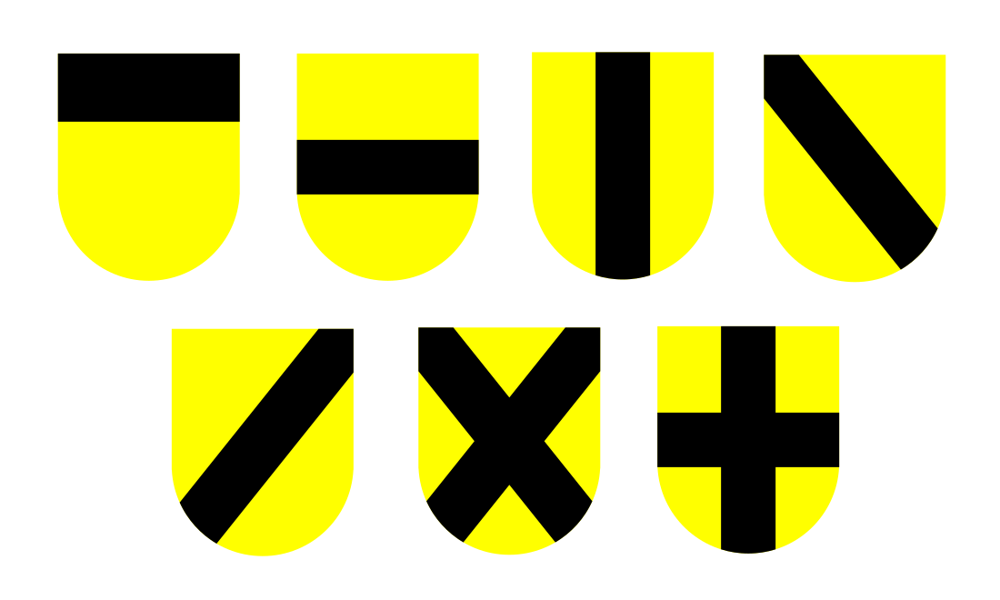
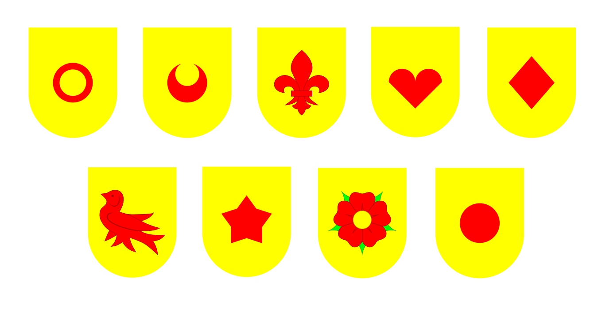

## Simple Heraldry Illustrator
This repository contains some simple tools to create images of heraldic shields. Currently, you can create shields using the basic colors and metals as well as the variations fo ermine.
Most to the traditional ordinaries are supported: fess, pale, chief, bend, bend sinister, saltire and cross:



Several basic charges can be used: annulet, crescent, fleur-de-lis, heart, lozenge, martlet, mullet, rose, roundel:



To create a shield, use the [__Builder__](src/main/java/net/remgant/heraldry/Builder.java) class to construct the shield and a [__FileWriter__](src/main/java/net/remgant/heraldry/FileWriter.java) instance to save to a file. 

For instance, for the basic cas of "or a fess guile":

```Java
  Builder builder = new Buidler(fileWriter.createGraphics());
  builder.add(new Shield(Tincture.OR);
  builder.add(new Fess(Tincture.GULES);
  builder.build(g -> {
    fileWriter.writeToFile("or-a-fess-gules.png"):
  });
```
Which would produce:


When placing charges on the filed, you need to specify not only the tincture, but the relative location of the field and the scaling of the charge. For "sable, three bezants in pale":

```Java
    Builder builder = new Buidler(fileWriter.createGraphics());
    builder.add(new Shield(Tincture.SABLE);
    builder.add(new Roundel(Tincture.OR, Shield.Position.PALE_TOP, 1.0));
    builder.add(new Roundel(Tincture.OR, Shield.Position.CENTER, 1.0));
    builder.add(new Roundel(Tincture.OR, Shield.Position.PALE_BOTTOM, 1.0));
    builder.build(g -> {
       fileWriter.writeToFile("sable-three-bezants-in-pale.png"):
    });
```
This produces:


Builder also has convenience methods so you could do the first example like this instead:
```Java
  Builder builder = new Buidler(fileWriter.createGraphics());
  builder.fieldOf(Tincture.OR)
    .fess(Tincture.GULES)
    .build(g -> {
        fileWriter.writeToFile("or-a-fess-gules.png"):
   });
```
In addition to various plain fields, the various divisions of the field are availabe. 

There's an example program [__DrawRandom__](src/main/java/net/remgant/heraldry/DrawRandom.java) to create a bunch of random shields. It's a good example of how to 
contruct various types of shield but there are a few cases where it violates the color/metal rule or the field and charge don't contrast enough.
