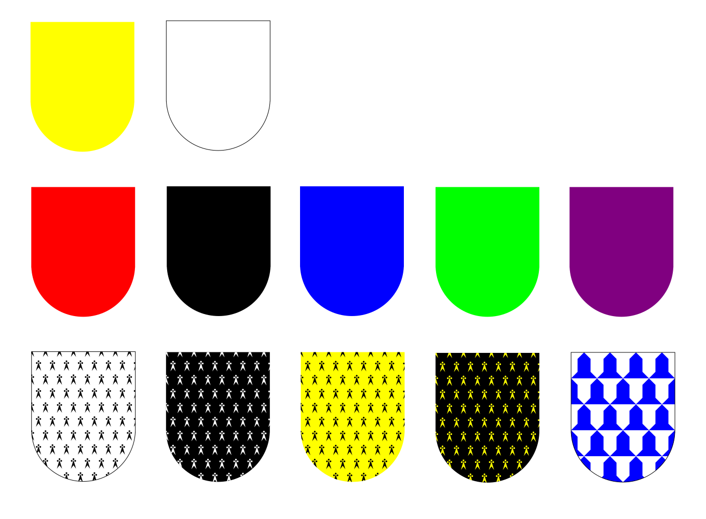
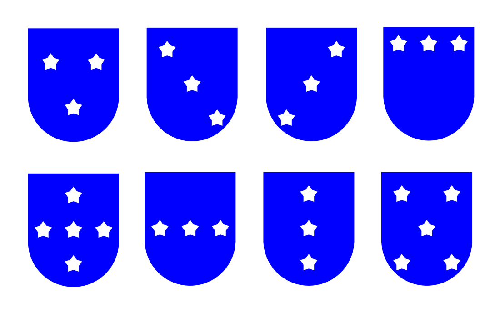
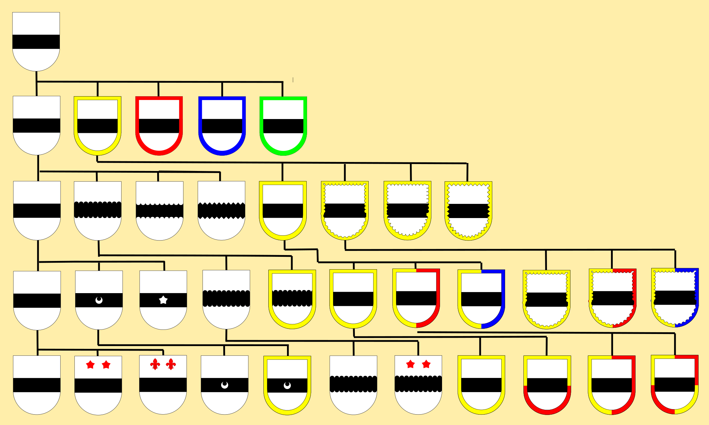

<!--
Copyright 2025 Jeffrey D. Remillard <jdr@remgant.net>

This file is part of the Remgant Heraldry Library hosted at https://github.com/jdrem/heraldry.

The Remgant Heraldry Library is free software: you can redistribute it and/or modify it under the terms of the GNU General Public
License as published by the Free Software Foundation, either version 3 of the License, or (at your option) any
later version.

This program is distributed in the hope that it will be useful, but WITHOUT ANY WARRANTY; without even the implied
warranty of MERCHANTABILITY or FITNESS FOR A PARTICULAR PURPOSE. See the GNU General Public License for more details.

You should have received a copy of the GNU General Public License along with this program. If not,
see <https://www.gnu.org/licenses/>.
-->

## Simple Heraldry Illustrator
This repository contains some simple tools to create images of heraldic shields. 

### Metals, Colors and Furs

Currently, you can create shields using the basic colors and metals as well as the variations fo ermine.



### Ordinaries, Subordinaries and Charges

Most to the traditional ordinaries are supported: fess, pale, chief, bend, bend sinister, saltire and cross:


Two of the subordinaries are available: the border and the label. The border is available in several variartions and can be divided for different tincutes. Useful for
differencing (see [Stodart System](#the-stodart-system)).

Several basic charges can be used: annulet, crescent, fleur-de-lis, heart, lozenge, martlet, mullet, rose, roundel:


Multiple charges can be arranged in a variety of ways:



### How to Build Shields

To create a shield, use the [__Builder__](src/main/java/net/remgant/heraldry/Builder.java) class to construct the shield and a [__FileWriter__](src/main/java/net/remgant/heraldry/FileWriter.java) instance to save to a file. 

For instance, for the basic cas of "or a fess guile":

```Java
  FileWriter fileWriter = new PNGFileWriter(200, 250);
  Builder builder = new Buidler(fileWriter);
  builder.add(new Shield(Tincture.OR);
  builder.add(new Fess(Tincture.GULES);
  builder.build(fw -> {
    fw.writeToFile("or-a-fess-gules.png"):
  });
```
Which would produce:


When placing charges on the filed, you need to specify not only the tincture, but the relative location of the field and the scaling of the charge. For "sable, three bezants in pale":

```Java
    FileWriter fileWriter = new PNGFileWriter(200, 250);
    Builder builder = new Buidler(fileWriter);
    builder.add(new Shield(Tincture.SABLE);
    builder.add(new Roundel(Tincture.OR, Shield.Position.PALE_TOP, 1.0));
    builder.add(new Roundel(Tincture.OR, Shield.Position.CENTER, 1.0));
    builder.add(new Roundel(Tincture.OR, Shield.Position.PALE_BOTTOM, 1.0));
    builder.build(fw -> {
       fw.writeToFile("sable-three-bezants-in-pale.png"):
    });
```
This produces:


Builder also has convenience methods so you could do the first example like this instead:
```Java
  FileWriter fileWriter = new PNGFileWriter(200, 250);
  Builder builder = new Buidler(fileWriter);
  builder.fieldOf(Tincture.OR)
    .fess(Tincture.GULES)
    .build(fw -> {
        fw.writeToFile("or-a-fess-gules.png"):
   });
```
In addition to various plain fields, the various divisions of the field are availabe. 

### Demo Programs

There are two demo programs.

First there is [__DrawRandom__](src/main/java/net/remgant/heraldry/DrawRandom.java) which creates a bunch of random shields. It's a good example of how to 
contruct various types of shield but there are a few cases where it violates the color/metal rule or the field and charge don't contrast enough.

Second is [__DrawEverything__](src/main/java/net/remgant/heraldry/DrawEverything.java) which generates examples of most of the ordinaries and charges. It was used to 
generate the sample images above.

### The Stodart System

One of my original goals was to recreate the well known diagram of the Stodart system for differencing arms in Scotland. I created invected, engrailed and indented versions of the fess and border. The border can also partitioned by color in a variety of ways. 

I've never been able to track down the origin of the diagram although I've seen variations in many places. I've also never tracked the orginal document by Stodart or really any sort of written description. In any case, it's likely
this is more of a guideline than any sort of formal rule. Presumably, the heralds have considerable discretion on what to actuall do. This chart was take from [Innes of Learney's _Scots Heraldry_](https://lccn.loc.gov/56004200).

The correct precedence of border colors has argent for the third son. The rule is that if the border matches the field, the border should be checked with another tinccutre, usally the tincture of the ordinary or principal charge. Like most of the sources I'm skipping argent for simplicity's sake.

The shields were created in by the [__StodarySystem__](src/main/java/net/remgant/heraldry/StodarSystem.java] class.



### Image Sources

Most of the designs were done by me using the Java AWT toolkit. 

The [Martlet](src/main/java/net/remgant/heraldry/Martlet.java), [Rose](src/main/java/net/remgant/heraldry/Rose.java) and 
[Fleur-de-Lis](src/main/java/net/remgant/heraldry/FleurDeLis.java) charges were derived from SVG files created by Wikiemedia user [Hstoops](https://commons.wikimedia.org/wiki/User:Hstoops).

The files are:

* https://commons.wikimedia.org/wiki/File:Martlet_Fourth_son.svg
* https://commons.wikimedia.org/wiki/File:Fleur-de-lys_Sixth_son.svg
* https://commons.wikimedia.org/wiki/File:Rose_Seventh_son.svg

These files is licensed under the [Creative Commons Attribution 4.0 International license](https://creativecommons.org/licenses/by/4.0/deed.en).
